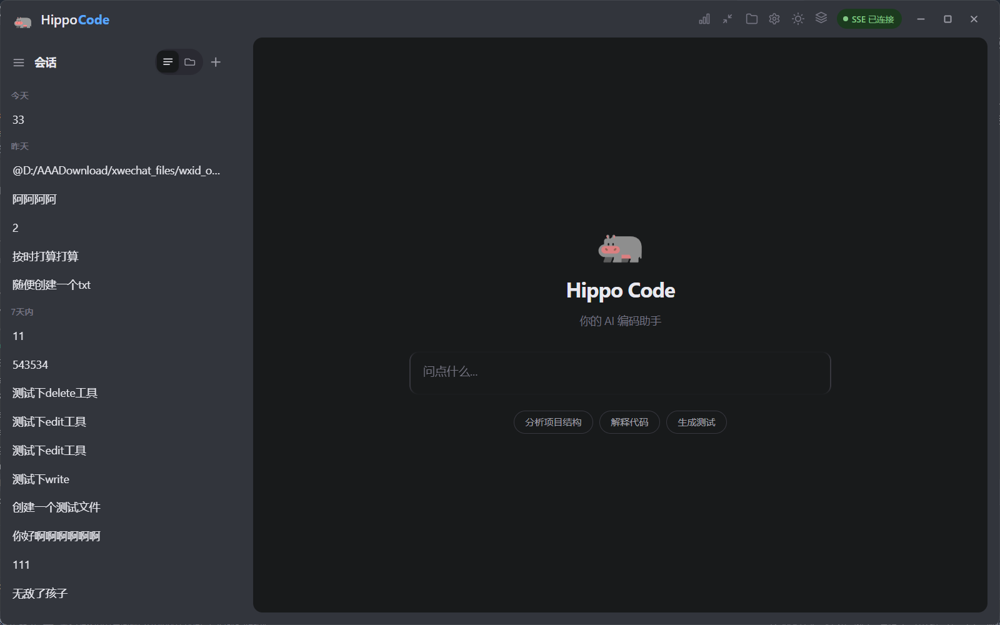
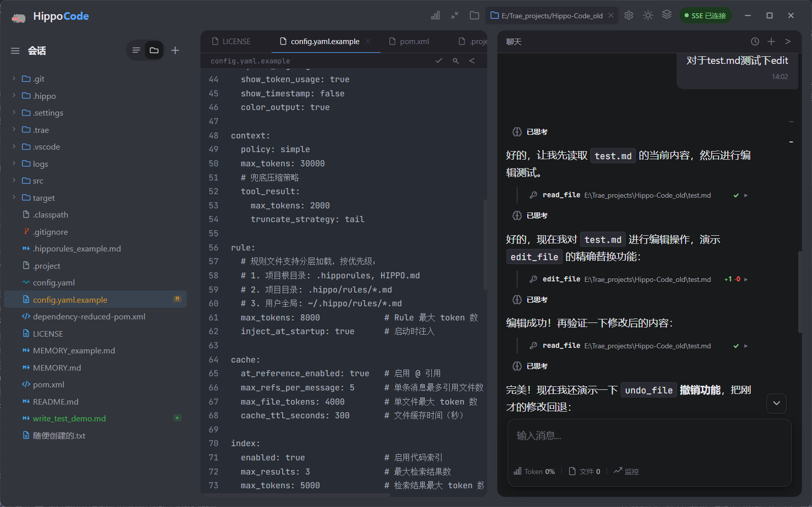

<h1 align="center">Hippo Code</h1>

<p align="center">基于 Java 21 的 AI 编程助手 · 多 LLM 提供商 · DAG 任务编排 · 多代理并行</p>

<p align="center">
  简体中文 ｜ <a href="./docs/README.en.md">English</a>
</p>

<p align="center">
  
  
  
  
  
  
  
  
</p>

<p align="center">
  
  
</p>

Hippo Code 是一个基于 Java 21 的 AI 编程助手，支持多 LLM 提供商、多代理并行执行、MCP/LSP 协议集成，可在终端 CLI、Web Dashboard 和桌面窗口三种模式下运行。

---

## 特色

- **DAG 任务编排** — 自动分析工具依赖，并行/顺序混合执行
- **多代理系统** — 主 Agent 自动分解任务，子 Agent 独立并行执行
- **10+ 安全拦截器** — 危险命令白名单、并发编辑检测、Diff 确认等层层防护
- **长期记忆** — 对话中自动提取关键信息，跨会话知识关联
- **MCP / LSP 协议** — 动态工具注册、代码导航（跳转/引用/悬停）
- **多 LLM 提供商** — OpenAI / Ollama / DashScope 统一接口
- **三端运行** — 终端 CLI / Web Dashboard / 桌面窗口

---

## 快速开始

```bash
mvn compile -q                          # 编译
mvn test -q                             # 运行测试
mvn package -DskipTests                 # 打包
```

---

## 启动方式

| 入口        | 命令                                          | 说明                 |
| ----------- | --------------------------------------------- | -------------------- |
| CLI         | `java com.example.agent.CliApplication`       | 终端交互模式         |
| CLI + Web   | 加 `--web` 参数                               | 终端 + Web Dashboard |
| Web         | `java com.example.agent.WebApplication`       | 纯 Web 服务          |
| Desktop     | `java com.example.agent.DesktopApplication`   | 桌面窗口             |

---

## 配置

复制 `config.yaml.example` 为 `config.yaml`，修改 LLM 配置：

```yaml
llm:
  api_key: your-api-key
  model: gpt-4o
  base_url: https://api.openai.com/v1
```

---

## CLI 端核心命令

| 命令        | 说明       |
| ----------- | --------   |
| `/help`     | 帮助       |
| `/clear`    | 清屏       |
| `/reset`    | 重置会话   |
| `/tokens`   | Token 统计 |
| `/mode`     | 切换工作模式 |
| `/exit`     | 退出       |

---

## 项目结构

```
src/main/java/com/example/agent/
├── CliApplication.java           CLI 入口
├── WebApplication.java           Web 入口
├── DesktopApplication.java       桌面端入口
├── core/                         核心模块（上下文、安全拦截、事件总线）
├── llm/                          LLM 客户端（OpenAI / Ollama / DashScope）
├── tools/                        内置工具集（20+ 工具）
├── orchestrator/                 DAG 任务编排引擎
├── subagent/                     多代理系统
├── mcp/                          MCP 协议集成
├── lsp/                          LSP 语言服务
├── memory/                       长期记忆系统
├── console/                      终端交互
└── config/                       配置中心
```

---

## 技术栈

- **Java 21** + 虚拟线程
- **JLine** 终端交互
- **Jackson / OkHttp / JTokkit**
- **JUnit 5 + Mockito**
- **Maven**
