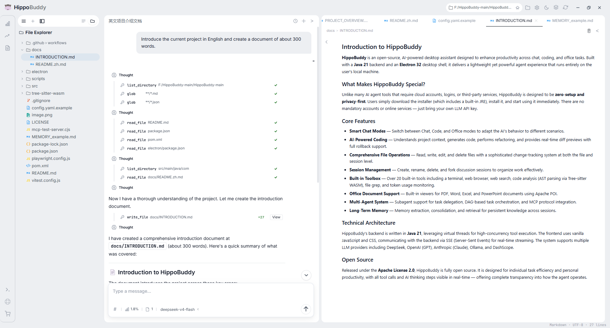

<h1 align="center">
  
  HippoBuddy
</h1>

<p align="center">AI-powered desktop assistant for chat, coding, and office productivity.</p>

<p align="center">
  <a href="./docs/README.zh.md">简体中文</a> ｜ English
</p>

<p align="center">
  
  
  
  
  
  
  
</p>

<p align="center">
  
</p>

---

## Download

| Platform | Download |
|---|---|
| Windows | [HippoBuddy Setup](https://github.com/Puteitous/HippoBuddy/releases/latest) |
| macOS (Intel) | [HippoBuddy.dmg](https://github.com/Puteitous/HippoBuddy/releases/latest) |
| macOS (Apple Silicon) | [HippoBuddy-arm64.dmg](https://github.com/Puteitous/HippoBuddy/releases/latest) |
| Linux (AppImage) | [HippoBuddy.AppImage](https://github.com/Puteitous/HippoBuddy/releases/latest) |

> 📖 Online documentation: [https://puteitous.github.io/HippoBuddy/](https://puteitous.github.io/HippoBuddy/)

---

## Features

| Feature | Description |
|---|---|
| **Smart Chat** | Chat / Code / Office modes, switch anytime |
| **AI Coding** | Understand project context, generate & refactor code |
| **File Ops** | Read, write, edit, delete with diff & rollback |
| **Sessions** | Create, rename, delete, fork discussions |
| **Toolbox** | Token stats, terminal, browser, live monitor |
| **Onboarding** | Spotlight tour on first launch |

<p align="center">
  
  <br>
  <em>Chat panel and preview panel working together</em>
</p>

---

## Why HippoBuddy?

Compared to other AI agent tools (Codex, Claude Code, Copilot, Kimi, Trae Work, WorkBuddy):

| Dimension | HippoBuddy |
|---|---|
| **Open Source** | Full source, Apache 2.0 license |
| **Zero Setup** | No login, no accounts, no third-party services — download and use |
| **LLM Visibility** | Every tool call and thinking step is visible in real-time |
| **Code Editing** | Full read/write/edit with diff preview and rollback |
| **Office Documents** | Built-in viewer for PDF, Word, Excel, PPT, and more |
| **File Change System** | Track changes at file and session level, rollback anytime |
| **Context & Token Monitor** | Real-time token stats, context usage, LLM monitoring |
| **Built-in Tools** | 10+ tools: terminal, browser, search, file ops, code analysis, etc. |
| **Performance** | Lightweight desktop app, Java virtual-thread concurrency |
| **UI Design** | Minimalist and clean |
| **Platform** | Desktop (Windows / macOS / Linux) |

### What's missing

HippoBuddy is actively developed. Current limitations:

- Requires personal LLM API key + web search tool config
- Subagent, MCP, and Memory features are still maturing
- No plugin system, automated task pipeline, or browser automation yet
- Office file generation/editing relies on skill calls + external editors
- Third-party integration limited (falls under plugin scope)
- Large-context long-running stability still being validated
- Designed for personal task efficiency, not 24/7 online service

---

## Quick Start

### Option 1: Desktop (Recommended)

Download [installer](https://github.com/Puteitous/HippoBuddy/releases/latest) -> Install -> Launch -> Start using

### Option 2: From Source

```bash
# 1. Build Java backend
mvn package -DskipTests

# 2a. Launch desktop (Electron)
cd electron && npm install && npm start

# 2b. Or run web-only (no Electron)
mvn exec:java -Dexec.mainClass="com.example.agent.WebApplication"
```

> **Configuration** — When running from source, the app auto-creates `config.yaml` from [`config.yaml.example`](config.yaml.example) on first launch. Edit it with your LLM settings:
>
> ```yaml
> llm:
>   api_key: ${DEEPSEEK_API_KEY:-your-api-key-here}
>   model: deepseek-v4-flash
>   base_url: https://api.deepseek.com
> ```
>
> Supports **DeepSeek / Claude / GPT / Ollama**. See [`config.yaml.example`](config.yaml.example) for full reference.

---

## Tech Stack

| Layer | Technology |
|---|---|
| Desktop Shell | **Electron 32** |
| Frontend | Vanilla JS + CSS |
| Backend | **Java 21** + Virtual Threads |
| Build | Maven 3.9 |
| AI Protocol | OpenAI SDK / Ollama / DashScope |
| Testing | JUnit 5 + Playwright |

---

## Project Structure

```
src/main/java/com/example/agent/
├── WebApplication.java           Web entry
├── DesktopApplication.java       Desktop entry
├── core/                         DI, event bus, security blockers
├── llm/                          LLM clients (OpenAI, Claude, Ollama...)
├── tools/                        Built-in tools (20+)
├── execute/                      Agent conversation loop
├── orchestrator/                 Task orchestration (DAG)
├── subagent/                     Multi-agent system
├── mcp/                          MCP protocol
├── memory/                       Long-term memory
├── session/                      Session storage & transcripts
├── web/                          HTTP handlers & SSE streaming
├── prompt/                       Prompt library & management
├── domain/                       Rules, skills, content truncation
└── config/                       Configuration models
```

---

## Documentation

| Title | Link |
|---|---|
| HippoBuddy — Introduction | [docs/intro](https://puteitous.github.io/HippoBuddy/docs/intro) |
| Quick Start | [docs/quick-start](https://puteitous.github.io/HippoBuddy/docs/quick-start) |
| HippoBuddy Architecture Philosophy | [docs/architecture/philosophy](https://puteitous.github.io/HippoBuddy/docs/architecture/philosophy) |
| AI Agent Usage Tips | [docs/guides/agent-mindset](https://puteitous.github.io/HippoBuddy/docs/guides/agent-mindset) |
| What Is an AI Desktop App Loading on Startup? | [docs/guides/startup-loading](https://puteitous.github.io/HippoBuddy/docs/guides/startup-loading) |

---

## License

[Apache License 2.0](../LICENSE)
