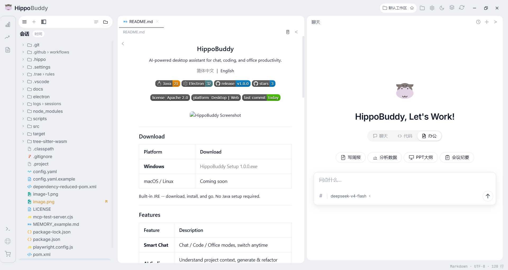

<h1 align="center">HippoBuddy</h1>

<p align="center">AI-powered desktop assistant for chat, coding, and office productivity.</p>

<p align="center">
  简体中文 ｜ <a href="../README.md">English</a>
</p>

<p align="center">
  
  
  
  
  
  
  
</p>

<p align="center">
  
</p>

---

## 下载安装

| 平台 | 下载 |
|---|---|
| **Windows** | [HippoBuddy Setup 1.0.0.exe](https://github.com/Puteitous/Hippo-Code/releases) |
| macOS / Linux | 待发布 |

内嵌 JRE，下载后直接安装，无需额外配置 Java 环境。

---

## 功能概览

| 功能 | 说明 |
|---|---|
| **智能对话** | 聊天 / 代码 / 办公三种模式，自由切换 |
| **AI 编程协助** | 理解项目上下文，生成、修改、重构代码 |
| **文件操作** | 读、写、编辑、删除，支持 diff 回滚 |
| **会话管理** | 新建、重命名、删除、分叉讨论 |
| **工具箱** | Token 统计、终端、浏览器、实时监控等 |
| **新手指引** | 首次启动聚光灯导览，快速上手 |

---

## 快速开始

### 桌面端（推荐）

下载安装包 -> 安装 -> 启动 -> 开始使用

### 源码启动

```bash
# 编译
mvn compile -q

# 运行 Web 端
mvn exec:java -Dexec.mainClass="com.example.agent.WebApplication"

# 运行桌面端
mvn exec:java -Dexec.mainClass="com.example.agent.DesktopApplication"
```

---

## 配置

复制 `config.yaml.example` 为 `config.yaml`，配置 LLM：

```yaml
llm:
  api_key: your-api-key
  model: deepseek-chat
  base_url: https://api.deepseek.com/v1
```

支持 DeepSeek / Claude / GPT / Ollama 本地模型。

---

## 技术栈

| 层 | 技术 |
|---|---|
| 桌面壳 | **Electron 32** |
| 前端 | 原生 JS + CSS |
| 后端 | **Java 21** + 虚拟线程 |
| 构建 | Maven 3.9 |
| AI 协议 | OpenAI SDK / Ollama / DashScope |
| 测试 | JUnit 5 + Playwright |

---

## 项目结构

```
src/main/java/com/example/agent/
├── WebApplication.java           Web 入口
├── DesktopApplication.java       桌面端入口
├── core/                         核心模块
├── llm/                          LLM 客户端
├── tools/                        内置工具集
├── orchestrator/                 任务编排引擎
├── subagent/                     多代理系统
├── mcp/                          MCP 协议集成
├── lsp/                          LSP 语言服务
├── memory/                       长期记忆
└── config/                       配置中心
```

---

## 许可证

[Apache License 2.0](../LICENSE)
